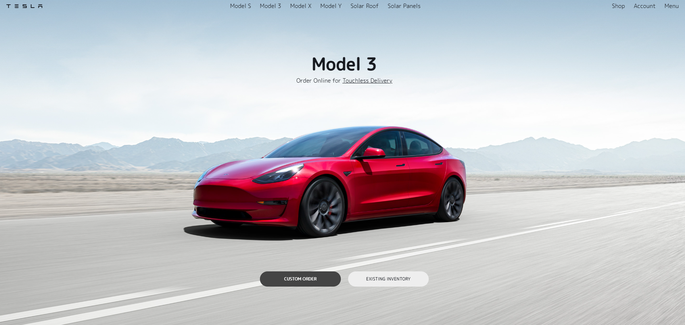

Documentation for Tesla Landing Page Clone:

1. Introduction
This project is a responsive web design template that incorporates an interactive sidebar menu and dynamic content presentation based on scroll position. The primary technologies used include HTML, CSS, and JavaScript.

2. Features
Interactive Sidebar Menu:
Toggleable sidebar menu.
The backdrop darkens the rest of the page when the menu is active.
Clicking outside the menu or on the close button will hide the sidebar.
Dynamic Content Presentation:
Sections become fully visible when they occupy more than 50% of the viewport.
Sections fade out when they occupy less than 50% of the viewport.

3. Usage
To open the sidebar menu: Click on the button with the id menuBtn.

To close the sidebar menu:

Click on the close button inside the sidebar.

Click outside the menu on the darkened backdrop.

Scrolling through the page:

As you scroll, the sections that come into the viewport and occupy more than 50% of the space will become fully visible.

Sections that occupy less than 50% will become transparent.

4. Technical Details

4.1. Sidebar Interactions:

The sidebar functionality is primarily controlled using the openMenu() and closeMenu() functions. These functions manipulate the className of the sidebar and backdrop elements to activate and deactivate them.

4.2. Scroll-based Interactions:

The Intersection Observer API is used to detect when sections intersect with the viewport. The threshold set at 0.5 (or 50%) ensures that the 'active' class is added to a section when more than half of it is visible. This is handled by the handleIntersection() function.

5. FAQ

Q: Can I add more sections?

A: Yes, you can add as many sections as you need. They will automatically be observed and will have the fade-in/fade-out effect applied as you scroll.

Q: How can I change the threshold for visibility?

A: Adjust the threshold value in the options object inside scroll.js. A value of 1 means 100% of the item must be in view, 0.5 is 50%, and so on.

